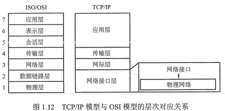
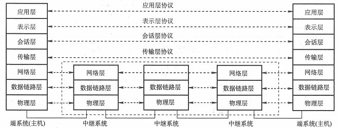

# 计算机网络

## 一、计算机网络体系结构

- 模型层次
    - 上三层：资源子网，是实现资源共享功能的设备和软件的集合
    - 传输层：承上启下
    - 下三层：通信子网，需要硬件，是硬件、介质和协议的集合
- 各层次的设备（通信子网才需要设备）
    - 网络层：路由器
    - 数据链路层：以太网交换机（多端口的网桥）
    - 物理层
    - 中继器
            - 信号再生，非简单放大
            - 无存储转发功能
            - 不能连接两个速率不同、协议不同的网段
            - $5-4-3$原则
                - 粗同轴电缆的$10BASE5$以太网中
                - 互相串联的中继器不超过$4$个
                - 连接$5$段通信介质
                - $5$段通信介质里有$3$段可以挂载计算机
        - 集线器（$Hub$，多端口的中继器）

- 各层次的功能
    - 应用层：提供用户与网络的接口
    - 表示层：数据解密、压缩、格式转换
    - 会话层：允许不同主机的进程进行会话
    - 传输层
    - 网络层：控制报文通过网络的路由选择
    - 数据链路层：保证数据的按序到达和完整性
    - 物理层：处理信号通过介质的传输

- 两种体系结构的协议栈的区别：
    - $ISO/OSI$ 参考模型
        - 在传输层仅支持面向连接的通信
        - 在网络层支持无连接和面向连接的通信
    - $TCP/IP$参考模型
        - 在传输层支持无连接和面向连接的通信
        - 在网络层仅支持无连接的通信

- 传输层实现两个用户进程之间端到端的通信

## 二、物理层

### 2.1 通信基础

- 比特率=波特率$\times log_2n$，$n$是每个码元离散值数
- 极限传输率
    - 奈氏无噪声：$2Wlog_2V(b/s)$
    - 香农有噪声：$Wlog_2(1+\frac{S}{N})(b/s)$

- 分组交换
    - 面向连接的虚电路方式
        - 采用多路复用技术
        - 分为永久性虚电路$PVC$和交换型虚电路$SVC$
            - $PVC$提前定义好，基本不需要任何建立时间，会话结束不取消
            - $SVC$提供端点之间的临时性连接，会话结束会取消
    - 面向无连接的数据报方式

### 2.2 传输介质